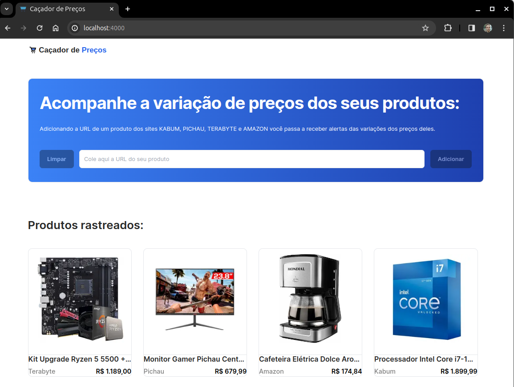

# Price Hunter (Caçador de Preços)

Hello everyone, I made this project to track the price trends of some products I wanted to purchase and to be notified when would be the best time to buy them. This helped me gain a better understanding of how web scraping works with Cheerio and web crawling with Puppeteer.

For now, this project only runs on localhost as it faces some issues regarding security policies to execute the crawling operation on serverless platforms.

Check the online version here:
https://cacador-de-precos.vercel.app/
Important: The function to add a new product will not work due to Vercel's security policies regarding the use of Puppeteer. In topic 8 below, I explain how to perform this process automatically on your computer.

## Main Page



## Product Page


## Technology

Here are the technologies used in this project.

- React JS
- React Icons
- Puppeteer
- Cheerio
- Tailwind CSS
- NextJS
- Typescript
- Nodemailer
- Axios
- Mongoose

## Services Used

- Github
- Linux Crontab Jobs

## Links

- Repository: https://github.com/jonasmkunzler/cacadordeprecos
  - In case of sensitive bugs like security vulnerabilities, please contact
    jonasmkunzler@gmail.com directly instead of using issue tracker. We value your effort
    to improve the security and privacy of this project!

## Clone this project

1. **Clone the repository**

   Open your terminal and run the following command to clone the repository:

   ```bash
   git clone https://github.com/jonasmkunzler/cacador-de-precos.git
   ```

2. **Navigate to the project directory**

   ```bash
   cd cacadordeprecos
   ```

3. **Install Node.js**

   The project requires Node.js to run. If you don't have it installed, you can download it from [here](https://nodejs.org/en/download/).

4. **Install the required packages**

   The project requires several packages to be installed. Run the following command to install them:

   ```bash
   npm i
   ```

5. **Install the required fonts**

   The project requires the "font-inter" and "font-spaceGrotesk" fonts to be available. You can download them from [Google Fonts](https://fonts.google.com/).

6. **Set up the environment variables**

   The project requires the MONGODB_URI environment variable to be defined. You can do this in a `.env` file in the root of your project:

   ```bash
   MONGODB_URI=your_mongodb_uri
   EMAIL_USERNAME=your_email_username
   EMAIL_PASSWORD=your_email_password
   ```

7. **Start the server**

   Run the following command to start the server:

   ```bash
   npm run dev
   ```

   Now, you should be able to access the project at `http://localhost:4000`.

8. **Configure the localhost server**

   I use Ubuntu 23.10 for this configuration

   Run the command below in your project directory to create a build version of the project:

   ```bash
   npm run build
   ```

   Oper your terminal and run the following command:

   ```bash
   sudo crontab -e
   ```

   And add this two lines one your crontab to run the project every 30 minutes and the http request every 6 hours:

   ```bash
   30 * * * * cd /home/your-user-name/Documentos/GitHub/cacador-de-precos && npm start
   0 */6 * * * curl http://localhost:4000/api/cron
   ```

Please note that the project requires the 'm.media-amazon.com', 'media.pichau.com.br', 'kabum.com.br' and 'terabyteshop.\*' domain to be accessible for image handling. If you are unable to access this domain, you may encounter issues with image loading.

## Author

**Jonas Kunzler**

If this project helped you, please leave a star on GitHub.
